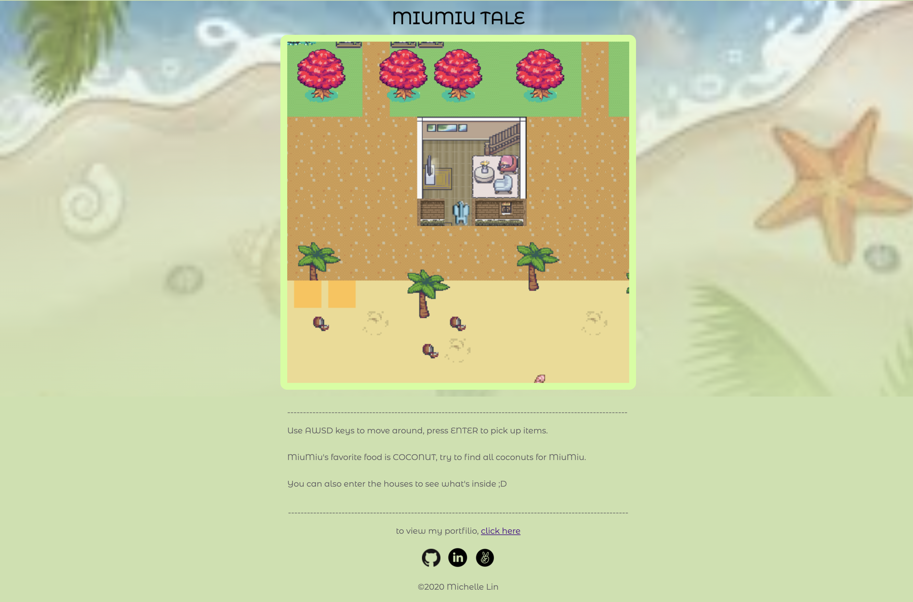
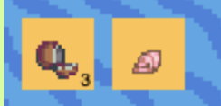
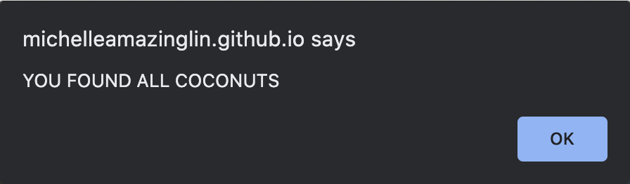
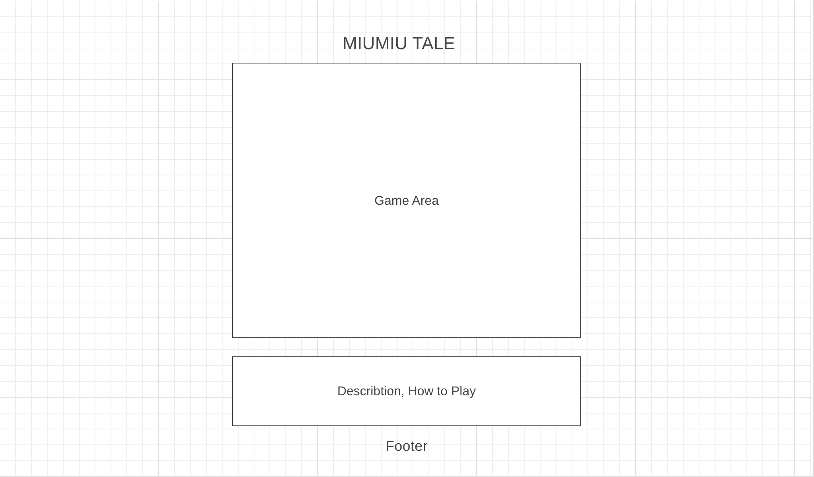

# MiuMiu Tale
[MiuMiu Tale Live](https://michelleamazinglin.github.io/miumiu-tale/)

## BACKGROUND ###

MiuMiu Tale take place in a fantasy world where MiuMiu lives. Users can move around the map using AWSD key, and use ENTER key to pick up items on the map. MiuMiu's favorite food is COCONUT, so if user pick up all coconuts in the world, you win.

## INSTRUCTION ###

use AWSD key to move around the map, and use ENTER key to pick up items. (try to find all coconuts on the map)

## FUNCTIONALITY AND MVP ###

users will be able to:
1. control miumiu to walk around the map using arrow keys
2. not showing the whole map, but a camera following the player (player in the middle)
3. can enter building to see what is inside
4. pick up objects

Bonus:
1. bag to keep track of things miumiu pick up

2. Alert when find all coconut on the map

## WIREFRAME ###

> **Page layout**

> **game map**

## TECHNOLOGIES ###

* Javascript
* HTML canvas
* CSS
* Aseprite(for game art)

## TIMELINE ###

**DAY 1**
> * create a map
> * tile art and setup tile type

**DAY 2**
> * a charactor that can move around

**DAY 3**
> * camera follows character

**DAY 4**
> * rendering houses
> * character can walk into houses

**DAY 5**
> * rendering pick up items on map
> * user can pick up items using space key
